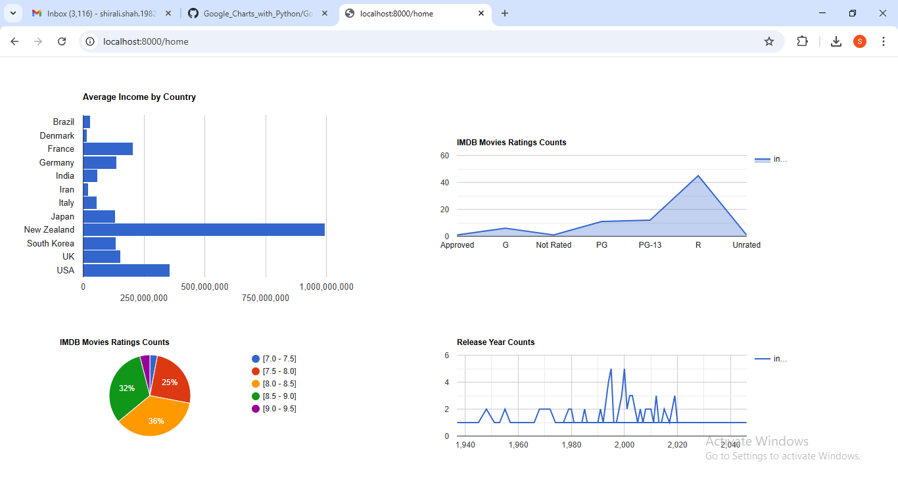

# Google Charts with Python

I've made a dashboard application using Google Charts library, FastAPI, Jinja2, Pandas and Core Python.

Dashboard looks like this:

To run the project, go to main.py and type uvicorn main:app --reload in VS Code.

Dashboard can be accessed at localhost:8000/home
